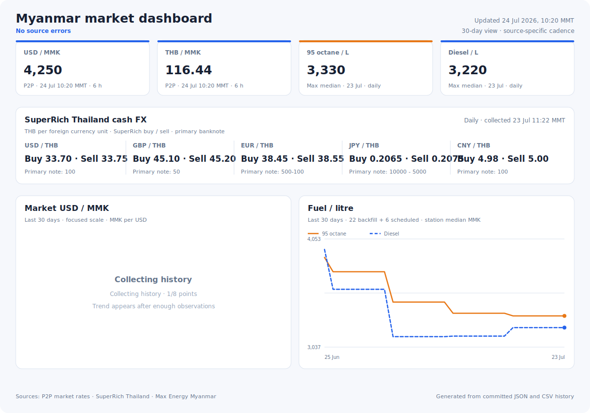

# mm-market-data

Automated collector for **real market** prices in Myanmar — updated by GitHub Actions and
committed back to this repo, so the `data/` folder doubles as a free JSON API via
`raw.githubusercontent.com`.

## At a glance

[](data/latest.json)

The dashboard is regenerated from the committed JSON snapshots and CSV history after
every scheduled pull. Fuel includes a source-backed 30-day Max Energy backfill; the P2P
FX trend begins with this repository's first actual observation because no equivalent
public historical P2P series exists.

| Dataset | What you get | Update cadence |
| --- | --- | --- |
| **MMK market FX** | USD/MMK, THB/MMK from **P2P (USDT) market rates** — *not* the official CBM rate | every 6 h |
| **THB retail cash FX** | SuperRich Thailand buy/sell quotes for USD, GBP, EUR, JPY, and CNY banknotes | every 6 h |
| **Official vs market spread** | CBM fixed rate next to the market rate, with spread % | every 6 h |
| **Fuel** | Max Energy gasoline (octane-95) & diesel median station prices in MMK/litre, + USD equivalents | daily |

## Why not the official rate?

The Central Bank of Myanmar fixes USD/MMK (e.g. 2100), which does not reflect the price
people actually pay. This repo uses **USDT/MMK peer-to-peer ads** as the market benchmark
(~4200+ in mid-2026), and also records the official rate so you can see the spread.
Note P2P USDT rates track the cash/street rate closely but are not identical to it.

## Data sources

| Source | Used for | Notes |
| --- | --- | --- |
| `superrich.tech/api/p2p-rates` | USD/MMK, USD/THB market rates | Aggregated Binance P2P ads; works from CI IPs where Binance is geo-blocked |
| [SuperRich Thailand](https://www.superrichthailand.com/) | USD/THB, GBP/THB, EUR/THB, JPY/THB, CNY/THB retail cash quotes | Primary advertised banknote denomination; both SuperRich buy and sell rates are retained |
| Binance P2P API (direct) | USD/MMK fallback | Median of top 10 USDT-sell ads; skipped automatically when geo-blocked |
| Central Bank of Myanmar API | official reference rate | For the spread calculation only |
| Frankfurter (ECB reference) | interbank USD/THB, USD/EUR | Context for the P2P THB rate |
| [Max Energy Myanmar](https://www.maxenergy.com.mm/fuel-prices-list/) | gasoline & diesel prices | Median of the non-zero daily prices shown across Max Energy stations |

## Using the data

Once this repo is on GitHub, the latest snapshot is available at:

```
https://raw.githubusercontent.com/<you>/<repo>/master/data/latest.json
```

Per-topic files: `data/exchange_rates.json` and `data/fuel.json`.
Append-only change history (great for charts): `data/history/*.csv`. SuperRich cash quote
changes are stored separately in `data/history/superrich_thailand.csv` so they cannot be
confused with the P2P USD/THB proxy. An unchanged denomination/buy/sell set does not add a
duplicate row.

The previous gold snapshot and history remain in the repository for backwards
compatibility, but they are no longer displayed or refreshed automatically.

`latest.json` shape:

```jsonc
{
  "updated_at_utc": "…",
  "fx": {
    "market":            { "USD_MMK": 4250.0, "USD_THB": 36.5, "THB_MMK": 116.44, "source": "…" },
    "official_reference":{ "USD_MMK": 2100.0, "source": "Central Bank of Myanmar …" },
    "interbank":         { "USD_THB": 33.565, "USD_EUR": 0.872, "…": "…" },
    "retail_cash": {
      "quote_currency": "THB",
      "quotes": {
        "USD": {
          "pair": "USD/THB",
          "denomination": "100",
          "buy_thb_per_unit": 33.50,
          "sell_thb_per_unit": 33.58,
          "midpoint_thb_per_unit": 33.54
        },
        "GBP": { "pair": "GBP/THB", "…": "…" },
        "EUR": { "pair": "EUR/THB", "…": "…" },
        "JPY": { "pair": "JPY/THB", "…": "…" },
        "CNY": { "pair": "CNY/THB", "…": "…" }
      },
      "source_updated_at_raw": "…",
      "source": "SuperRich Thailand retail cash exchange"
    },
    "market_vs_official_spread_pct": 102.38
  },
  "fuel": { "gasoline_95_usd_per_litre": 0.7894, "diesel_mmk_per_litre_market": 3140.0, "as_of": "2026-07-17" },
  "errors": []   // non-fatal source failures are listed here, never crash the workflow
}
```

## Setup

1. Create a new GitHub repo and push this code:

   ```bash
   git remote add origin git@github.com:<you>/<repo>.git
   git push -u origin master
   ```

2. That's it. Market FX runs every 6 hours (`cron: "23 */6 * * *"`), while Max Energy
   fuel runs daily at 08:17 Myanmar time (`cron: "47 1 * * *"`). Both workflows update
   the data, history, and README dashboard, and can also be triggered manually.

> Scheduled workflows can be delayed under GitHub load, and GitHub disables schedules
> after 60 days of repo inactivity — the bot commits usually keep it alive, but a manual
> run now and then doesn't hurt.

## Running locally

```bash
pip install -r requirements.txt
python update.py
```

Selective refreshes and the reproducible fuel backfill:

```bash
python update.py --topics fx
python update.py --topics fuel
python backfill_fuel.py --days 30
```

## Caveats

- **P2P ≠ exact street rate.** USDT/MMK ads are the best programmatically accessible
  proxy for the real market; cash rates in Yangon/Mandalay will differ slightly.
- **SuperRich buy/sell direction matters.** `buy_thb_per_unit` is the THB SuperRich pays
  when buying one unit of foreign cash; `sell_thb_per_unit` is the THB it charges when
  selling one unit. Quotes use the primary banknote denomination advertised by the site,
  recorded in each quote because smaller notes can receive different rates.
- **SuperRich's source timestamp is retained verbatim.** The site currently labels a
  Thailand wall-clock value with a UTC-like `Z`, so `source_updated_at_raw` is deliberately
  not presented as an `as_of` instant. Use the snapshot's `updated_at_utc` for ordering.
- **Fuel** figures are medians across the non-zero daily prices published for Max Energy's
  station network. They are direct MMK pump prices; USD equivalents are computed using the
  collected market FX rate. Actual prices vary by station and day.
- Historical fuel rows are labelled `backfill` or `scheduled` in the CSV. Backfilled MMK
  pump prices are genuine Max Energy observations; historical USD equivalents are left
  blank because no matching historical market-FX series is available. For backfilled
  rows, `as_of` is the API's source date and `ts_utc` is the archive retrieval time, not a
  historical observation timestamp.
- Third-party endpoints can change or go down; failures are logged in `errors` and the
  previous committed data stays in place until a source recovers.

## License

MIT — data belongs to the respective sources; check their terms before commercial use.
